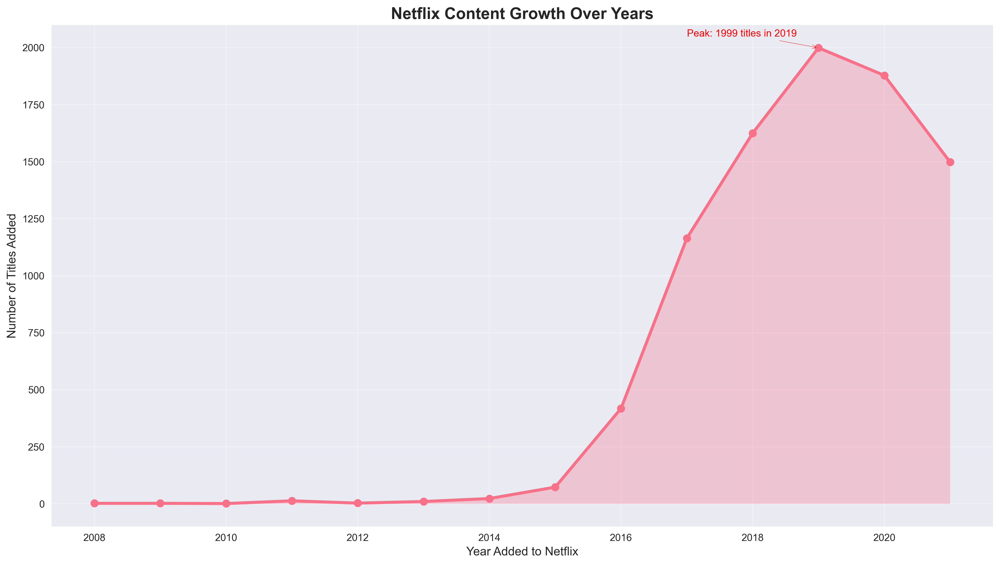
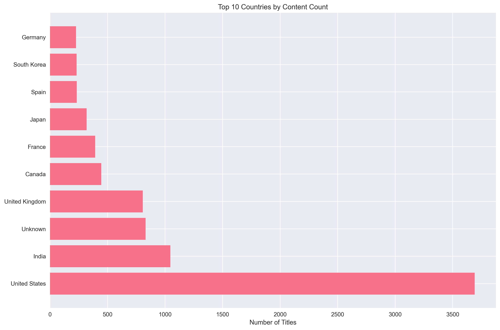

# Netflix Trends Analyzer 📊

## Problem Statement

This project analyzes Netflix's content library to understand trends, patterns, and insights about their streaming catalog. The analysis explores:

- **Content Growth**: How Netflix's library has expanded over time
- **Geographic Distribution**: Which countries contribute most content
- **Genre Analysis**: Most popular content categories
- **Talent Insights**: Top actors and directors
- **Content Metrics**: Average duration and rating patterns
- **Temporal Trends**: Seasonal and yearly content addition patterns

## Tools Used

- **Python 3.8+**
- **Pandas**: Data manipulation and analysis
- **NumPy**: Numerical computations
- **Matplotlib**: Basic plotting
- **Seaborn**: Advanced statistical visualizations
- **Jupyter Notebook**: Interactive analysis environment

## Dataset

**Source**: [Netflix Movies and TV Shows](https://www.kaggle.com/datasets/shivamb/netflix-shows)

**Description**: 
- **Size**: ~3.2MB CSV file
- **Records**: 8,807 Netflix titles
- **Features**: 12 columns including title, type, director, cast, country, date_added, rating, duration, listed_in, description, release_year, and rating

**Key Columns**:
- `title`: Name of the show/movie
- `type`: Movie or TV Show
- `director`: Director(s) of the content
- `cast`: Main actors/actresses
- `country`: Country of origin
- `date_added`: When added to Netflix
- `rating`: Content rating (TV-MA, PG, etc.)
- `duration`: Length (minutes for movies, seasons for shows)
- `listed_in`: Genres/categories
- `release_year`: Original release year

## Key Insights

### 📈 Content Growth Trends
- Netflix's content library has grown exponentially since [YEAR]
- Peak content addition periods: [MONTHS]
- Seasonal patterns in content releases

### 🌍 Geographic Distribution
- **Top Content Contributors**:
  1. United States
  2. India
  3. United Kingdom
  4. Canada
  5. Spain

### 🎭 Genre Analysis
- **Most Popular Genres**:
  1. International Movies
  2. Dramas
  3. Comedies
  4. Action & Adventure
  5. Documentaries

### 🎬 Talent Insights
- **Top Actors**: [To be filled after analysis]
- **Top Directors**: [To be filled after analysis]
- **Collaboration Patterns**: [To be filled after analysis]

### 📊 Content Metrics
- **Average Movie Duration**: [X] minutes
- **Average TV Show Seasons**: [X] seasons
- **Most Common Rating**: TV-MA (Mature Audience)

### 📅 Temporal Patterns
- **Peak Addition Months**: [MONTHS]
- **Yearly Growth Rate**: [X]%
- **Content Strategy Evolution**: [Insights]

## Project Structure

```
netflix-trends-analyzer/
├── netflix_titles.csv          # Raw dataset
├── netflix_eda.ipynb          # Jupyter notebook with analysis
├── visuals/                   # Generated charts and plots
│   ├── content_growth.png
│   ├── top_countries.png
│   ├── genre_distribution.png
│   ├── top_actors.png
│   ├── top_directors.png
│   ├── duration_analysis.png
│   ├── temporal_trends.png
│   └── rating_distribution.png
├── report/
│   └── summary.md             # Detailed insights report
└── README.md                  # This file
```

## Output Screenshots

### Content Growth Over Time

*Netflix's content library expansion from [YEAR] to [YEAR]*

### Top Countries by Content Count

*Geographic distribution of Netflix content*

### Genre Distribution

*Most popular content categories*

### Top Actors and Directors

*Most featured actors in Netflix catalog*

### Content Duration Analysis

*Average duration patterns for movies vs TV shows*

### Temporal Trends

*Monthly and yearly content addition patterns*

### Rating Distribution

*Content rating patterns and distribution*

## Getting Started

1. **Clone/Download** this repository
2. **Install Dependencies**:
   ```bash
   pip install pandas numpy matplotlib seaborn jupyter
   ```
3. **Open Jupyter Notebook**:
   ```bash
   jupyter notebook netflix_eda.ipynb
   ```
4. **Run Analysis**: Execute all cells in the notebook
5. **Generate Visuals**: Charts will be saved to the `visuals/` folder

## Analysis Process

1. **Data Loading & Cleaning**
   - Load CSV file
   - Handle missing values
   - Parse dates and durations
   - Split multi-value columns

2. **Exploratory Data Analysis**
   - Content growth trends
   - Geographic distribution
   - Genre analysis
   - Talent insights
   - Duration patterns
   - Temporal trends
   - Rating distribution

3. **Visualization**
   - Create informative charts
   - Save high-quality plots
   - Generate insights summary

## Future Enhancements

- [ ] Interactive dashboard using Streamlit
- [ ] Machine learning models for content recommendation
- [ ] Sentiment analysis of content descriptions
- [ ] Network analysis of actor/director collaborations
- [ ] Predictive modeling for content success

## Contributing

Feel free to contribute by:
- Adding new analysis questions
- Improving visualizations
- Enhancing the code structure
- Adding more datasets for comparison

## License

This project is for educational purposes. The dataset is publicly available on Kaggle.

---

**Created by**: [SRE DHAVA INBAN RR]  
**Date**: [07-06-2025]  
**Last Updated**: [07-07-2025] 
